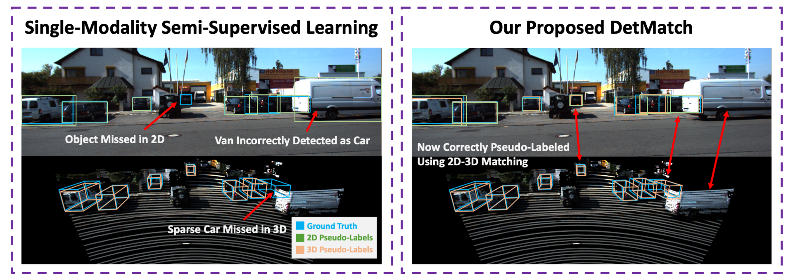

# DetMatch: Two Teachers are Better Than One for Joint 2D and 3D Semi-Supervised Object Detection
Jinhyung Park, Chenfeng Xu, Yiyang Zhou, Masayoshi Tomizuka, Wei Zhan

<p align="center">
    
</p>

## Introduction
While numerous 3D detection works leverage the complementary relationship between RGB images and point clouds, developments in the broader framework of semi-supervised object recognition remain uninfluenced by multi-modal fusion. Current methods develop independent pipelines for 2D and 3D semi-supervised learning despite the availability of paired image and point cloud frames. Observing that the distinct characteristics of each sensor cause them to be biased towards detecting different objects, we propose DetMatch, a flexible framework for joint semi-supervised learning on 2D and 3D modalities. By identifying objects detected in both sensors, our pipeline generates a cleaner, more robust set of pseudo-labels that both demonstrates stronger performance and stymies single-modality error propagation. Further, we leverage the richer semantics of RGB images to rectify incorrect 3D class predictions and improve localization of 3D boxes. Evaluating on the challenging KITTI and Waymo datasets, we improve upon strong semi-supervised learning methods and observe higher quality pseudo-labels.

## Environment Setup
```
conda env create -n detmatch -f conda_environment.yml
conda activate detmatch
pip install mmdet==2.14.0
pip install mmsegmentation==0.14.1
pip install -r requirements.txt
pip install -v -e .
cd thirdparty/Spconv-OpenPCDet/
python setup.py develop
cd ../..
pip install numba==0.53.0
```

## Data Setup
Please set-up the KITTI dataset as explained [here](https://github.com/open-mmlab/mmdetection3d/blob/1f79fc7b150f1a4b1d6cbb104ca5152b4c708d51/docs/2_new_data_model.md). Then, download the ssl splits, velodyne_reduced, and planes from [here](https://github.com/Divadi/DetMatch/releases/download/v0.1.0/kitti_data.tar.gz) and move it to `data/kitti`. The directory should look like:
```
data
├── kitti
│   ├── ImageSets
│   ├── kitti_gt_database
│   │   ├── 0_Pedestrian_0.bin
│   │   ├── 3_Car_0.bin
│   │   ├── ...
│   ├── ssl_splits
│   │   ├── kitti_dbinfos_train_lab_0.01_0.pkl
│   │   ├── kitti_dbinfos_train_lab_0.01_1.pkl
│   │   ├── ...
│   ├── testing
│   │   ├── calib
│   │   ├── image_2
│   │   ├── velodyne
│   │   ├── velodyne_reduced
│   ├── training
│   │   ├── calib
│   │   ├── image_2
│   │   ├── label_2
│   │   ├── planes
│   │   ├── velodyne
│   │   ├── velodyne_reduced
│   ├── kitti_dbinfos_train.pkl
│   ├── kitti_dbinfos_test.pkl
│   ├── kitti_infos_train_proj_3d.pkl
│   ├── kitti_infos_train.pkl
│   ├── kitti_infos_val.pkl
```

## Training
Configs are [here](configs/detmatch). This folder includes configs for pre-training, training of confidence thresholded 2D/3D baselines, and DetMatch.
To, for instance, train on the 1% setting:
```
./tools/dist_train.sh configs/detmatch/001/pretrain_frcnn/split_0.py 3 --gpus 3 --autoscale-lr
./tools/dist_train.sh configs/detmatch/001/pretrain_frcnn/split_1.py 3 --gpus 3 --autoscale-lr
./tools/dist_train.sh configs/detmatch/001/pretrain_frcnn/split_2.py 3 --gpus 3 --autoscale-lr

./tools/dist_train.sh configs/detmatch/001/pretrain_pvrcnn/split_0.py 3 --gpus 3 --autoscale-lr
./tools/dist_train.sh configs/detmatch/001/pretrain_pvrcnn/split_1.py 3 --gpus 3 --autoscale-lr
./tools/dist_train.sh configs/detmatch/001/pretrain_pvrcnn/split_2.py 3 --gpus 3 --autoscale-lr

./tools/dist_train.sh configs/detmatch/001/confthr_frcnn/split_0.py 3 --gpus 3 --autoscale-lr
./tools/dist_train.sh configs/detmatch/001/confthr_frcnn/split_1.py 3 --gpus 3 --autoscale-lr
./tools/dist_train.sh configs/detmatch/001/confthr_frcnn/split_2.py 3 --gpus 3 --autoscale-lr

./tools/dist_train.sh configs/detmatch/001/confthr_pvrcnn/split_0.py 3 --gpus 3 --autoscale-lr
./tools/dist_train.sh configs/detmatch/001/confthr_pvrcnn/split_1.py 3 --gpus 3 --autoscale-lr
./tools/dist_train.sh configs/detmatch/001/confthr_pvrcnn/split_2.py 3 --gpus 3 --autoscale-lr

./tools/dist_train.sh configs/detmatch/001/detmatch/split_0.py 3 --gpus 3 --autoscale-lr
./tools/dist_train.sh configs/detmatch/001/detmatch/split_1.py 3 --gpus 3 --autoscale-lr
./tools/dist_train.sh configs/detmatch/001/detmatch/split_2.py 3 --gpus 3 --autoscale-lr
```
By default, all methods are trained on 3 GPUs.

## Evaluation & Pre-Trained Models.
By default, evaluation is done at the end of the training cycle. To access pre-trained models and training logs, please download the outputs folders from [here](https://github.com/Divadi/DetMatch/releases/tag/v0.1.0).

After downloading, a pre-trained model can be evaluated as such:
```
./tools/dist_test.sh configs/detmatch/001/detmatch/split_0.py outputs/detmatch/001/detmatch/split_0/iter_5000.pth 3 --eval kitti
```
This will print out the results for the 2D teacher, the 3D teacher, the 2D student, and the 3D student.

One can also average the metrics for the three splits using the `average_runs` [script](tools/average_runs.py). This pulls information from the log.json file, using the evaluation results at the end of training. For example:
```
# Average metrics for 2D
python tools/average_runs.py --type 2d --log_jsons outputs/detmatch/001/pretrain_frcnn/split_0 outputs/detmatch/001/pretrain_frcnn/split_1 outputs/detmatch/001/pretrain_frcnn/split_2

# Average metrics for 3D
python tools/average_runs.py --type 3d --log_jsons outputs/detmatch/001/pretrain_pvrcnn/split_0 outputs/detmatch/001/pretrain_pvrcnn/split_1 outputs/detmatch/001/pretrain_pvrcnn/split_2

# Average metrics for 2D SSL
python tools/average_runs.py --type ssl2d --log_jsons outputs/detmatch/001/confthr_frcnn/split_0 outputs/detmatch/001/confthr_frcnn/split_1 outputs/detmatch/001/confthr_frcnn/split_2

# Average metrics for 3D SSL
python tools/average_runs.py --type ssl3d --log_jsons outputs/detmatch/001/confthr_pvrcnn/split_0 outputs/detmatch/001/confthr_pvrcnn/split_1 outputs/detmatch/001/confthr_pvrcnn/split_2

# Average metrics for DetMatch (Both modalities)
python tools/average_runs.py --type fusion --log_jsons outputs/detmatch/001/detmatch/split_0 outputs/detmatch/001/detmatch/split_1 outputs/detmatch/001/detmatch/split_2
```

From this, you should get results:
### 3D Detection Performance
|Method|1% mAP|1% Car|1% Ped|1% Cyc|2% mAP|2% Car|2% Ped|2% Cyc|20% mAP|20% Car|20% Ped|20% Cyc|
|:-:|:-:|:-:|:-:|:-:|:-:|:-:|:-:|:-:|:-:|:-:|:-:|:-:|
|**Labeled-Only**|41.61|72.22|24.45|28.16|53.36|76.12|41.86|42.09|61.53|79.68|45.05|59.88|
|**Conf. Thresh**|51.44|75.82|40.17|38.34|63.42|77.84|48.36|64.07|67.23|80.78|51.96|68.95|
|**DetMatch**    |58.51|78.90|56.71|39.92|65.87|80.63|53.47|63.52|69.33|82.12|56.97|68.89|

### 2D Detection Performance
|Method|1% mAP|1% Car|1% Ped|1% Cyc|2% mAP|2% Car|2% Ped|2% Cyc|20% mAP|20% Car|20% Ped|20% Cyc|
|:-:|:-:|:-:|:-:|:-:|:-:|:-:|:-:|:-:|:-:|:-:|:-:|:-:|
|**Labeled-Only**|65.75|87.55|70.04|39.65|69.18|89.86|71.49|46.19|63.45|88.76|63.27|38.32|
|**Conf. Thresh**|60.22|88.08|70.14|22.44|65.27|90.13|71.31|34.36|66.42|91.29|69.87|38.08|
|**DetMatch**    |70.92|90.80|73.62|48.35|74.93|92.44|75.31|57.04|74.32|93.27|72.05|57.65|

## Acknowledgements
We thank numerous excellent works and open-source codebases:
- [MMDetection3D](https://github.com/open-mmlab/mmdetection3d)
- [OpenPCDet](https://github.com/open-mmlab/OpenPCDet)
- [3DIoUMatch](https://github.com/THU17cyz/3DIoUMatch)
- [Spconv](https://github.com/traveller59/spconv)

## BibTeX
If this work is helpful for your research, please consider citing:
```
@inproceedings{Park2022DetMatchTT,
  title={DetMatch: Two Teachers are Better Than One for Joint 2D and 3D Semi-Supervised Object Detection},
  author={Jinhyung D. Park and Chenfeng Xu and Yiyang Zhou and Masayoshi Tomizuka and Wei Zhan},
  booktitle={European Conference on Computer Vision},
  year={2022}
}
```
