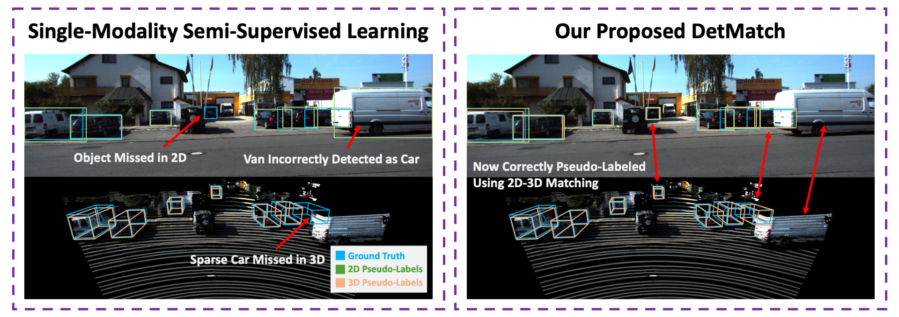

# DetMatch: Two Teachers are Better Than One for Joint 2D and 3D Semi-Supervised Object Detection
Jinhyung Park, Chenfeng Xu, Yiyang Zhou, Masayoshi Tomizuka, Wei Zhan

    

## Introduction
While numerous 3D detection works leverage the complementary relationship between RGB images and point clouds, developments in the broader framework of semi-supervised object recognition remain uninfluenced by multi-modal fusion. Current methods develop independent pipelines for 2D and 3D semi-supervised learning despite the availability of paired image and point cloud frames. Observing that the distinct characteristics of each sensor cause them to be biased towards detecting different objects, we propose DetMatch, a flexible framework for joint semi-supervised learning on 2D and 3D modalities. By identifying objects detected in both sensors, our pipeline generates a cleaner, more robust set of pseudo-labels that both demonstrates stronger performance and stymies single-modality error propagation. Further, we leverage the richer semantics of RGB images to rectify incorrect 3D class predictions and improve localization of 3D boxes. Evaluating on the challenging KITTI and Waymo datasets, we improve upon strong semi-supervised learning methods and observe higher quality pseudo-labels.

Code will be released soon.
